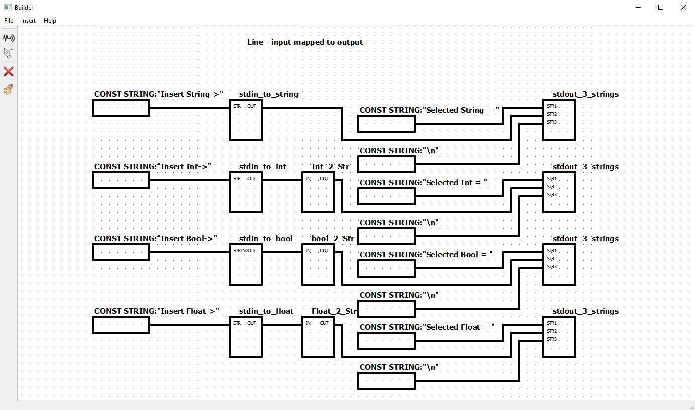

# Editor a interpret hierarchicky strukturovaných funkčních bloků

## Editor - uvažujte diagramy funkčních bloků.
  
*  Umožněte editaci atomických bloků, které mají 0-m vstupních a 0-n výstupních pojmenovaných portů a jsou specifikovány obecným víceřádkovým textem (editor nekontrojuje syntax, ale počítejte s C/C++). Každý takový blok má jméno a je chápán jako instanciovatelný typ, který je součástí knihovny typů bloků.
  
*  Umožněte editaci kompozitních bloků, které mají 0-m vstupních a 0-n výstupních pojmenovaných portů a jsou specifikovány propojením pojmenovaných instancí existujících typů bloků z knihovny (implicitní jméno je číslo instance, lze ho uživatelsky přejmenovat). Propojky propojují výstupy bloků na vstupy bloků, výstup může být připojen na více vstupů a na vstup může být připojeno víc výstupů. Porty kompozitu mou být připojeny na vstupy vnitřních bloků, výstupy vnitřních bloků kompozitu mohou být připojeny na jeho výstupní porty. Propojení bloků může tvořit cyklické struktury.

*  Kompozitní bloky jsou také knihovní typy.

*  Editor umožní zobrazit obsah knihovny. Knihovna typů bloků by měla být strukturována do kategorií. Kategorie lze přidávat, přejmenovávat, rušit. Součástí specifikace typu bloku je i kategorie. Knihovna je perzistentní (definujte způsob uložení do souboru).

*  Umožněte editaci aplikací, což jsou speciální případy kompozitních bloků bez portů, které nemohou být použity jako instanciovatelné typy a nejsou součástí knihovny typů, ale jsou součástí knihovny aplikací.

*  Vizuálně je každá instance bloku obdélník. Záhlaví zobrazuje typ a jméno instance (pokud je zadáno; číslo instance není potřeba zobrazovat, ale je k dispozici v rámci dialogu pro pojmenování a parametrizaci instance), vlevo jsou pojmenované vstupní porty, vpravo jsou pojmenované výstupní porty. U bloků se zaměnitelnými vstupy a jedním výstupem (např. AND, OR apod) není nutné porty pojmenovávat (kód bloku se na ně může odkazovat číslem).

* Některé nepřipojené vst. porty mohou mít nastavený konstantní vstup (string) - takovéto parametry lze specifikovat např. v rámci dialogu pro pojmenování a parametrizaci instance. Parametr se zobrazí u odpovídajícího portu (v případě delšího textu zobrazte jeho rozumně dlouhý prefix a ideálně při najetí myši zobrazte detail).

 ## Generování kódu a interpretace

* Umožněte vygenerování kódu pro iterativní vyhodnocování bloků aplikace. Jde kód v C++, který interpretuje blokový diagram a průběžně generuje stav (hodnoty vst./výst. portů všech instancí typů bloků).

* Blok si během interpretace pamatuje poslední hodnoty a změny na svých vstupech. Při změně na kterémkoli vstupním portu se naplánuje vyhodnocení bloku. Vyhodnocením se může změnit hodnota vnitřní proměnné bloků, může se generovat výstup na některém portu, případně se naplánuje zpožděný výstup nebo změna stavu. Vyhodnocování bloků provádějte cyklicky přes všechny bloky se změnami na vstupu a bloky s připravenými zpožděnými výstupy. Pokud není žádná změna na vstupu žádného bloku a žádná vstupní data a žádná čekající událost, interpretace končí.

* Uvažujte jednoduché atomické bloky pro porovnání čísel, inkrement, dekrement, čtení a zápis dat z/do souboru nebo stdin/stdout apod., ideálně i bloky pro zpoždění.
